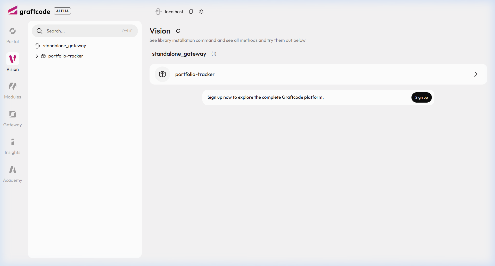
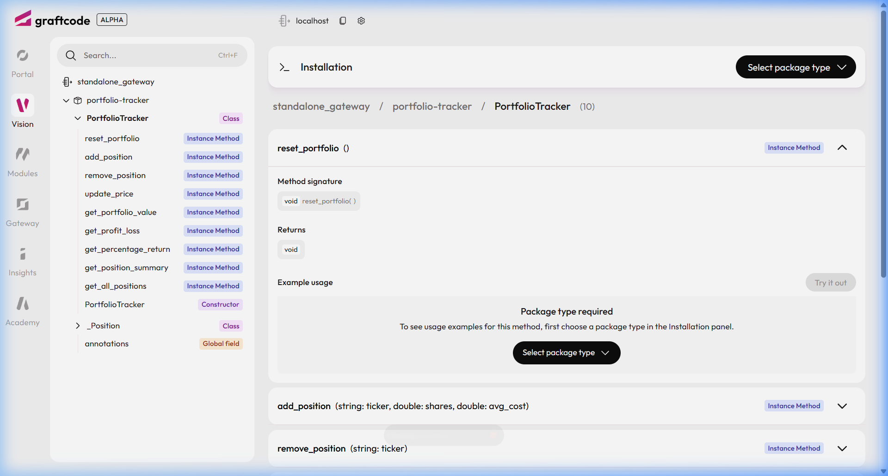
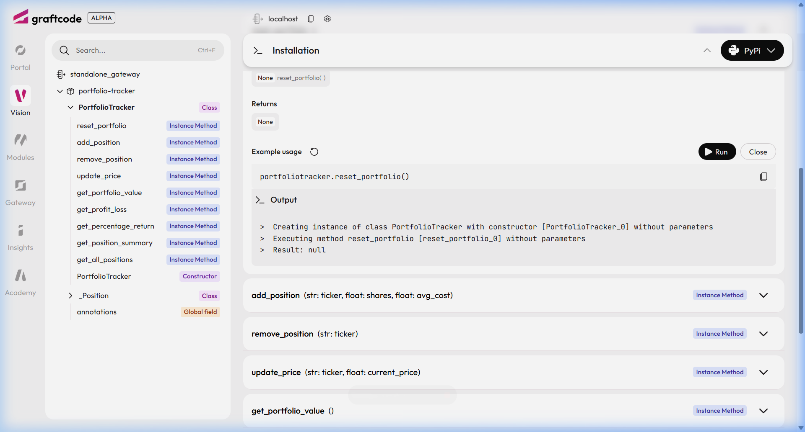
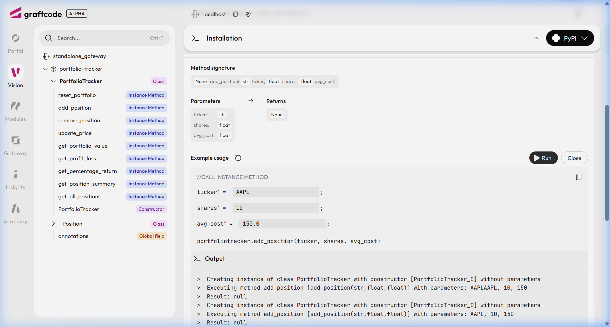
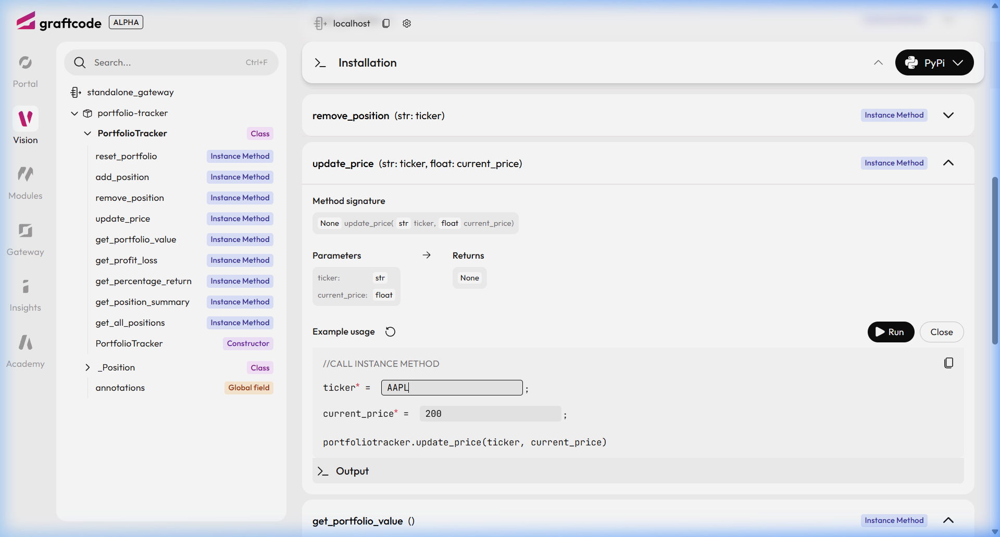
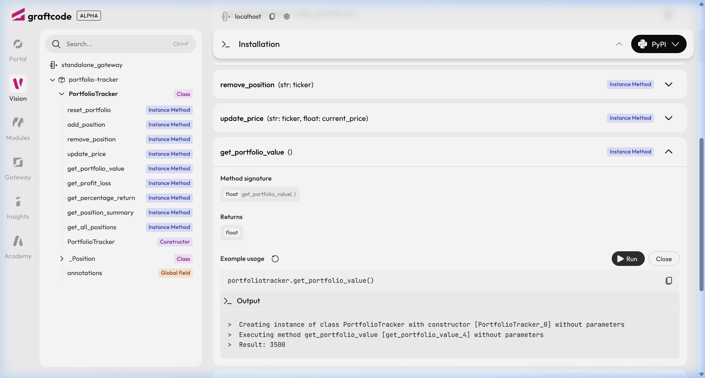

# Stock Portfolio Tracker — Graftcode Gateway Demo

> **A plain Python class, remotely callable via code or browser — zero HTTP framework required.**

This demo shows how [Graftcode Gateway](https://github.com/grft-dev/graftcode-gateway) (`gg`) exposes a pure Python class as a remotely callable service without Flask, FastAPI, Django, or any other HTTP framework. You write business logic; Graftcode handles the transport.

Once deployed, every public method is instantly available in two ways:
- **Programmatically** — via a strongly-typed Graft client
- **Visually** — via [Graftcode Vision](#graftcode-vision---browser-ui), the built-in browser UI that lets you call methods interactively, no client code needed

---

## Overview

`PortfolioTracker` is an in-memory stock portfolio manager that supports:

| Operation | Method |
|---|---|
| Add / replace a holding | `add_position(ticker, shares, avg_cost)` |
| Remove a holding | `remove_position(ticker)` |
| Update market price | `update_price(ticker, current_price)` |
| Total portfolio value | `get_portfolio_value()` |
| Total profit / loss | `get_profit_loss()` |
| Portfolio % return | `get_percentage_return()` |
| Per-ticker breakdown | `get_position_summary(ticker)` |
| Full portfolio snapshot | `get_all_positions()` |

Prices are supplied by the caller via `update_price()` — there is no live market data feed, which keeps the demo offline and dependency-free.

---

## Why No HTTP Framework Is Required

Traditional service communication looks like this:

```
Your Class → Flask/FastAPI → HTTP Routes → JSON → HTTP Client → Consumer
```

With Graftcode Gateway it looks like this:

```
Your Class → gg (Gateway binary) → Strongly-typed Graft → Consumer
```

The `gg` binary **introspects** the public method signatures of `PortfolioTracker` at startup. It reads the type hints, generates typed clients (Grafts), and exposes every public method as a callable endpoint — all without you writing a single route, schema, or serialisation layer.

From the consumer's side a remote call looks identical to a local function call:

```python
# With a Graft (remote)               # Without a Graft (local)
tracker.add_position(                 tracker.add_position(
    "AAPL", 100.0, 150.0                  "AAPL", 100.0, 150.0
)                                     )
```

The networking, serialisation, and transport stay entirely outside your business logic.

---

## High Level Architecture Diagram

### Traditional REST vs Graftcode Gateway

```
┌─────────────────────────────────────────────────────────────────────────┐
│                     TRADITIONAL REST APPROACH                           │
│                                                                         │
│  ┌──────────────┐   routes/   ┌──────────────┐  HTTP/JSON  ┌─────────┐ │
│  │ PortfolioTr- │  schemas/   │  Flask /     │ ──────────► │Consumer │ │
│  │ acker class  │ ──────────► │  FastAPI /   │             │(any     │ │
│  │  (business   │  boilerpl.  │  Django app  │ ◄────────── │ lang)   │ │
│  │   logic)     │             │  (HTTP layer)│             │         │ │
│  └──────────────┘             └──────────────┘             └─────────┘ │
│                                                                         │
│  You maintain: routes, schemas, serialisation, versioning, HTTP client  │
└─────────────────────────────────────────────────────────────────────────┘

┌─────────────────────────────────────────────────────────────────────────┐
│                     GRAFTCODE GATEWAY APPROACH                          │
│                                                                         │
│  ┌──────────────┐  type-hint  ┌──────────────┐  Hypertube™ ┌─────────┐ │
│  │ PortfolioTr- │  introspect │  Graftcode   │ ──────────► │ Typed   │ │
│  │ acker class  │ ──────────► │  Gateway     │             │  Graft  │ │
│  │  (business   │             │  (gg binary) │ ◄────────── │(auto-   │ │
│  │   logic)     │             │  port 5002   │             │generated│ │
│  └──────────────┘             └──────────────┘             └─────────┘ │
│                                                                         │
│  You maintain: ONLY the Python class. Zero routes, zero schemas.        │
└─────────────────────────────────────────────────────────────────────────┘
```

### Request Flow — How a Remote Call Works

```
                          CALLER SIDE                      SERVICE SIDE
                    ┌─────────────────┐              ┌─────────────────────┐
                    │                 │              │  Docker Container   │
  Consumer code     │  Graft Client   │              │  ┌───────────────┐  │
  ───────────────►  │  (auto-gen'd    │  Hypertube™  │  │  gg binary    │  │
  tracker.          │   typed client) │ ────────────►│  │  (Gateway)    │  │
  add_position(     │                 │              │  └──────┬────────┘  │
  "AAPL",100,150)   │                 │◄─────────────│         │ invokes   │
                    └─────────────────┘   response  │  ┌──────▼────────┐  │
                                                    │  │ PortfolioTr-  │  │
                                                    │  │ acker.        │  │
                                                    │  │ add_position()│  │
                                                    │  │ (plain Python)│  │
                                                    │  └───────────────┘  │
                                                    └─────────────────────┘
```

### Component Responsibilities

| Component | Role | Your Code? |
|---|---|---|
| `PortfolioTracker` class | Business logic only | ✅ Yes |
| `gg` (Gateway binary) | Transport, serialisation, routing | ❌ Provided by Graftcode |
| Graft client | Typed remote caller, auto-generated | ❌ Generated by Graftcode |
| Docker container | Packages `gg` + your module | ✅ Dockerfile (3 lines of config) |
| Hypertube™ | Runtime-level bridge between processes | ❌ Built into Graftcode |

---


## Project Structure

```
stock portfolio tracker/
├── AGENTS.md                         # Dev conventions (Python 3.11+, black, ruff, pytest)
├── portfolio_tracker/
│   ├── __init__.py
│   └── tracker.py                    # PortfolioTracker class — zero HTTP imports
├── tests/
│   ├── __init__.py
│   └── test_portfolio_tracker.py     # pytest suite (offline, no Docker needed)
├── Dockerfile                        # gg + Python runtime image
├── docker-compose.yml                # one-command local run
├── setup.py                          # package metadata (Python 3.11+)
├── pyproject.toml                    # black + ruff config
├── requirements-dev.txt              # black, ruff, pytest
└── README.md
```

---

## Installation

### 1. Clone the repo (if you haven't already)

```bash
git clone https://github.com/grft-dev/graftcode-demos
cd "graftcode-demos/stock portfolio tracker"
```

### 2. Create and activate a virtual environment

```bash
python -m venv .venv

# macOS / Linux
source .venv/bin/activate

# Windows (PowerShell)
.venv\Scripts\Activate.ps1
```

### 3. Install the package (editable) and dev tools

```bash
pip install -e .
pip install -r requirements-dev.txt
```

---

## Running Locally (Without Gateway)

You can import and call `PortfolioTracker` directly — it is a plain Python class:

```python
from portfolio_tracker.tracker import PortfolioTracker

tracker = PortfolioTracker()

# Build a portfolio
tracker.add_position("AAPL", shares=100, avg_cost=150.00)
tracker.add_position("MSFT", shares=50,  avg_cost=300.00)

# Supply latest prices (no live API — caller-provided)
tracker.update_price("AAPL", current_price=180.00)
tracker.update_price("MSFT", current_price=280.00)

# Query
print(tracker.get_portfolio_value())    # 32000.0
print(tracker.get_profit_loss())        # 2000.0
print(tracker.get_percentage_return())  # ~6.45 %
print(tracker.get_position_summary("AAPL"))
# {
#   'shares': 100.0, 'avg_cost': 150.0, 'current_price': 180.0,
#   'market_value': 18000.0, 'cost_basis': 15000.0,
#   'profit_loss': 3000.0, 'percentage_return': 20.0
# }
```

---

## Running Through Graftcode Gateway

### Option A — Docker Compose (recommended)

```bash
docker compose up --build -d
```

The gateway starts on:
- **Port 80** → Graft API endpoint (programmatic calls)
- **Port 81** → Graftcode Vision browser UI

### Option B — Docker directly

```bash
docker build -t stock-portfolio-tracker .
docker run -p 80:80 -p 81:81 stock-portfolio-tracker
```

### Option C — `gg` binary on the host

Install `gg` from the [latest release](https://github.com/grft-dev/graftcode-gateway/releases/latest), then:

```bash
gg --modules ./portfolio_tracker/
```

Once running, connect any Graftcode-compatible client to `localhost:80` to call `PortfolioTracker` methods as if they were local, or open `http://localhost:80` in a browser to use **Graftcode Vision**.

---

## Graftcode Vision — Browser UI

Graftcode Vision is the built-in browser-based interface that ships with every `gg` deployment. When the container is running, navigate to **`http://localhost:80`** (or `http://localhost:81`) to open it.

Vision **automatically discovers** all public methods of `PortfolioTracker` by introspecting the Python type hints — no manual registration, no Swagger/OpenAPI config, no code generation step.

### What Vision looks like

After navigating to `http://localhost:80`:

1. The **sidebar** shows: `standalone_gateway → portfolio-tracker → PortfolioTracker (10 methods)`
2. Expanding the class shows every public method with its signature, parameter types, and return type
3. Each method has a **"Try it out"** button that renders an interactive form



### Step-by-step: Deploy & interact via Vision

**Step 1 — Start the container**

```powershell
# From the 'stock portfolio tracker' directory
docker compose up --build -d
```

Expected output:
```
✔ Container stockportfoliotracker-portfolio-tracker-1  Started
```

Verify it's healthy:
```powershell
docker ps --filter "name=stockportfoliotracker"
# NAMES                                       STATUS          PORTS
# stockportfoliotracker-portfolio-tracker-1   Up X seconds    0.0.0.0:80-81->80-81/tcp
```

**Step 2 — Open Vision in your browser**

Navigate to: **`http://localhost:80`**

You will see the Vision dashboard with `portfolio-tracker` listed under `standalone_gateway`.

**Step 3 — Select the package type**

Click **`portfolio-tracker`** → **`PortfolioTracker`** in the sidebar, then click **"Select package type"** → choose **PyPi** to unlock the "Try it out" interactive forms.



**Step 4 — Reset the portfolio (clean slate)**

- Click `reset_portfolio` in the sidebar
- Click **"Try it out"** → **"Run"**
- Output:
  ```
  > Executing method reset_portfolio without parameters
  > Result: null
  ```



**Step 5 — Add stock positions**

Click `add_position` → **"Try it out"**, fill in the form fields, and click **"Run"**:

| ticker | shares | avg_cost | Expected result |
|--------|--------|----------|-----------------|
| `AAPL` | `100`  | `150.0`  | `null` ✅ |
| `MSFT` | `50`   | `300.0`  | `null` ✅ |
| `TSLA` | `20`   | `200.0`  | `null` ✅ |

Vision shows the generated call and live output:
```
> Executing method add_position with parameters: AAPL, 100, 150
> Result: null
```



**Step 6 — Update market prices**

Click `update_price` → **"Try it out"** for each price update:

| ticker | current_price | P&L impact |
|--------|--------------|------------|
| `AAPL` | `180.0`      | +$3,000 (+20%) |
| `MSFT` | `280.0`      | −$1,000 (−6.67%) |
| `TSLA` | `200.0`      | $0 (breakeven) |



**Step 7 — Read portfolio metrics**

Click each read method → **"Try it out"** → **"Run"**:




### All 10 methods discovered by Vision

| Method | Parameters | Returns |
|---|---|---|
| `reset_portfolio` | — | `None` |
| `add_position` | `str ticker`, `float shares`, `float avg_cost` | `None` |
| `remove_position` | `str ticker` | `bool` |
| `update_price` | `str ticker`, `float current_price` | `None` |
| `get_portfolio_value` | — | `float` |
| `get_profit_loss` | — | `float` |
| `get_percentage_return` | — | `float` |
| `get_position_summary` | `str ticker` | `dict` |
| `get_all_positions` | — | `list` |
| `PortfolioTracker` | — | Constructor |

> **How does Vision discover these automatically?**
> `gg` reads the Python type annotations in `tracker.py` at startup. No decorators, no registration, no schema files needed — just plain Python type hints.

---

## Running Tests

```bash
pytest tests/ -v
```

All tests are **offline** and **fast** — no network calls, no running Gateway or Docker container required.

Expected output (all passing):

```
tests/test_portfolio_tracker.py::TestAddPosition::test_add_new_position PASSED
tests/test_portfolio_tracker.py::TestAddPosition::test_add_position_case_insensitive PASSED
...
========================= 35 passed in 0.XXs =========================
```

---

## Linting & Formatting

```bash
# Format
black portfolio_tracker/ tests/

# Check formatting without modifying
black --check portfolio_tracker/ tests/

# Lint
ruff check portfolio_tracker/ tests/
```

---

## Example Requests / Responses

The examples below contrast the **traditional REST** pattern with the **Graftcode Graft** pattern. Notice that Graftcode has no HTTP method, URL, or JSON schema on the service side.

### Traditional REST (hypothetical — not what this demo does)

```http
POST /portfolio/positions HTTP/1.1
Content-Type: application/json

{ "ticker": "AAPL", "shares": 100, "avg_cost": 150.0 }
```

```json
{ "status": "ok" }
```

### Via Graftcode Graft (typed, no HTTP boilerplate)

```python
# Consumer code — looks like a local method call
tracker.add_position("AAPL", 100.0, 150.0)
tracker.update_price("AAPL", 180.0)

result = tracker.get_position_summary("AAPL")
```

```python
# Response — strongly typed Python dict, no JSON parsing needed
{
    "shares": 100.0,
    "avg_cost": 150.0,
    "current_price": 180.0,
    "market_value": 18000.0,
    "cost_basis": 15000.0,
    "profit_loss": 3000.0,
    "percentage_return": 20.0,
}
```

### Error handling — same as local Python

```python
tracker.update_price("UNKNOWN", 100.0)
# Raises: ValueError: Ticker 'UNKNOWN' not found in portfolio.

tracker.add_position("AAPL", shares=-5, avg_cost=150.0)
# Raises: ValueError: shares must be greater than zero, got -5.
```

---

## Key Points

- **Zero HTTP framework code** — `tracker.py` imports nothing from Flask, FastAPI, or Django.
- **Pure stdlib** — no `install_requires` at runtime.
- **Type hints throughout** — required by AGENTS.md; also what `gg` uses for introspection.
- **Offline by design** — prices are caller-supplied, keeping tests and local runs network-free.
- **Mirrors sdn-currency-converter** — same Dockerfile pattern, same `gg` invocation flags.

---

## References

- [Graftcode Gateway — GitHub](https://github.com/grft-dev/graftcode-gateway)
- [Graftcode Documentation](https://docs.graftcode.com)
- [What is Graftcode](https://docs.graftcode.com/introduction/what-is-graftcode)
